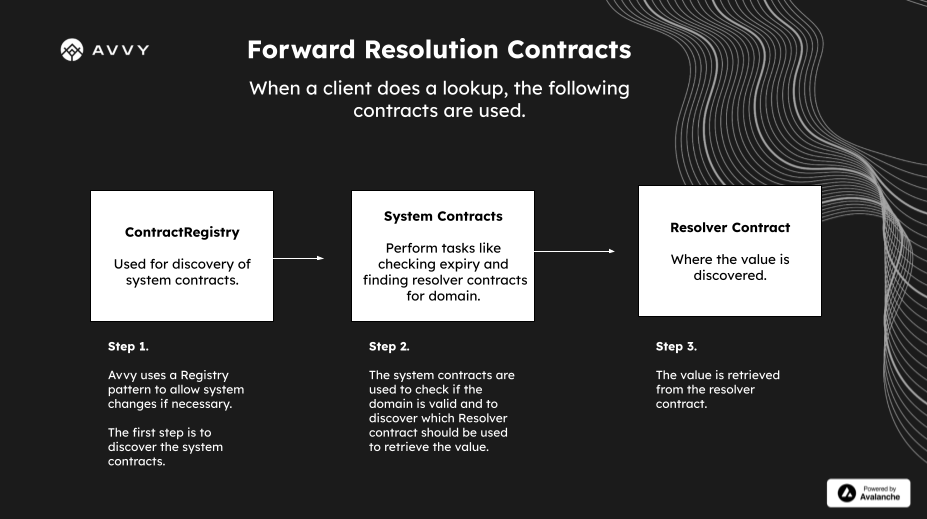

When we want to resolve a value from a .avax domain, we need to be aware that there are many factors that can change which value a domain resolves to.

Developers integrating the Avvy Domains system may want to be aware of the following situations where a value could change, and further how we can detect those changes.

## What happens during forward resolution?

The following diagram explains which contracts are used during forward resolution:




## Where can things change?

As a security precaution, projects may want to display alerts for users when values which impact forward resolution have been changed. 


### 1) ContractRegistry changes

The Avvy system supports logic changes using a Registry pattern. Contract addresses are discovered via a Registry. 

The `ContractRegistry` address is `0x4832D668C2c75Fa10C597FD19B116d2E1873ED69`. When a contract reference is set in the ContractRegistry it will emit a `Set(string contractName, address contractAddress)` event.

Contract references that may be used during resolution are: 

- `Domain` (the main ERC721 representing the domains)
- `ResolverRegistry` (keeps track of which `Resolver` contracts should be used for resolving domains)
- `NameHash` (utility contract used to convert a plaintext name into an ID in the system)

Projects can monitor events emitted by the ContractRegistry to determine when and how the Avvy Domains system has been updated.


### 2) ResolverRegistry changes

The `ResolverRegistry` is used to discover the contract which should be used to look up a value for a domain name. The holder of a domain can make changes to the `ResolverRegistry`.

The `ResolverRegistry` address is `0x3947d4c62C108A8A7bA3ED53AbaDcFF5D8998637`. When a Resolver is set for a given domain, a `ResolverSet` event is fired. Projects can monitor events emitted by the ResolverRegistry to determine when resolvers have been updated.


### 3) Resolver changes

Resolvers are recommended to emit the following events when resolution values change:

```
event StandardEntrySet(uint256 indexed datasetId, uint256 indexed hash, uint256[] path, uint256 key, string data);
event EntrySet(uint256 indexed datasetId, uint256 indexed hash, uint256[] path, string key, string data);
```

Custom resolvers can be implemented, so it is possible that some will not implement this interface.

`StandardEntrySet` events with `key=3` would represent changes to the EVM address that resolves.

